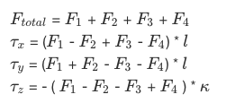
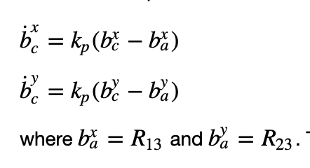
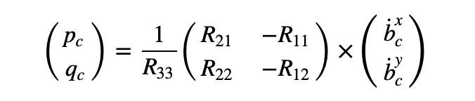
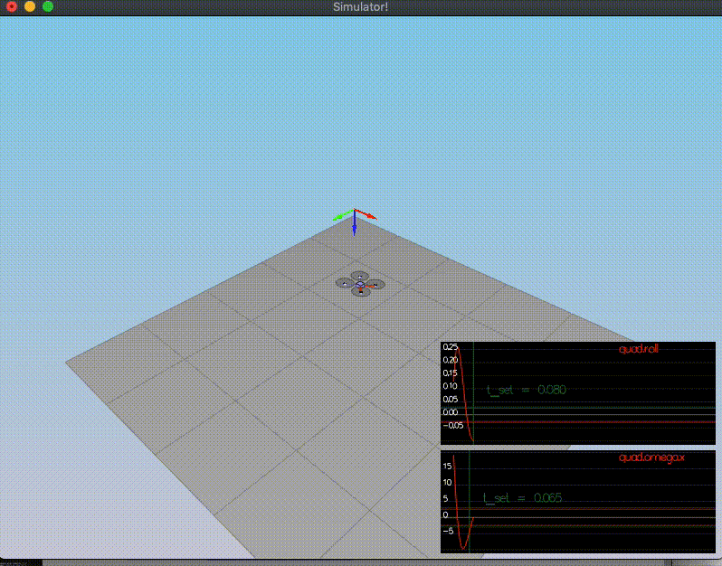
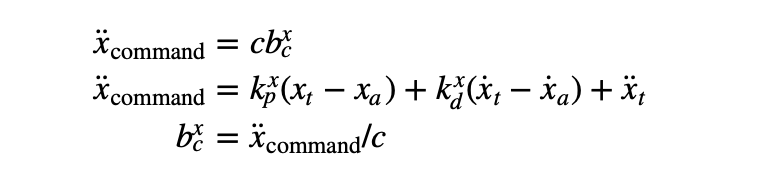
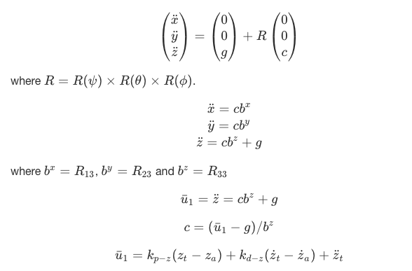
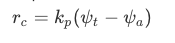
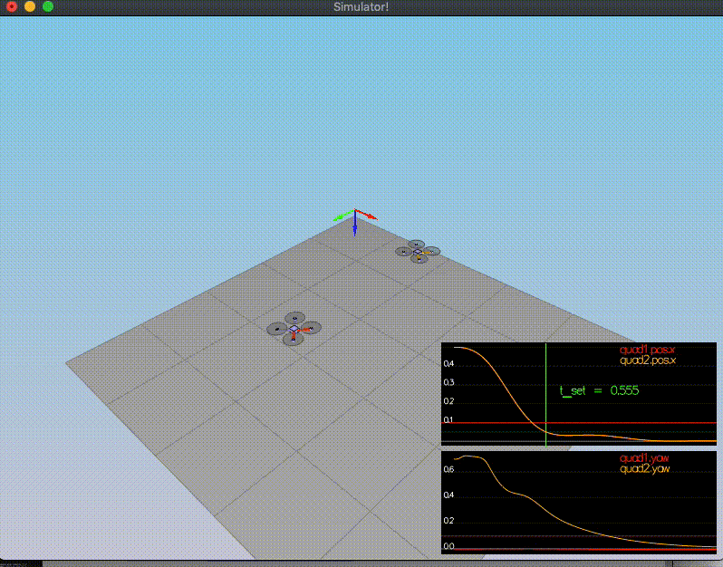
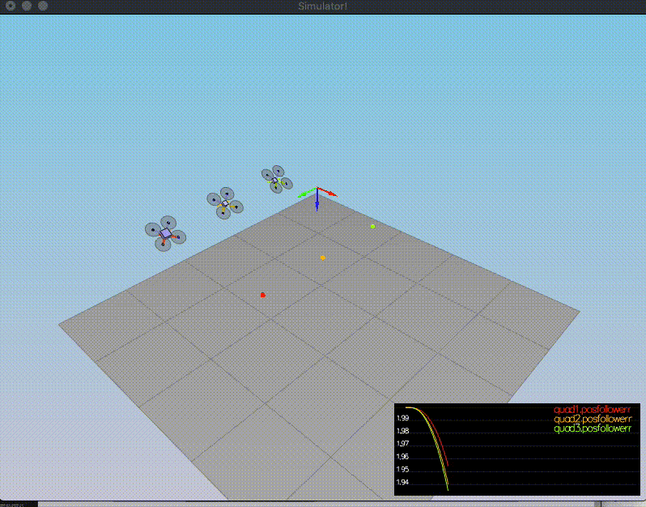
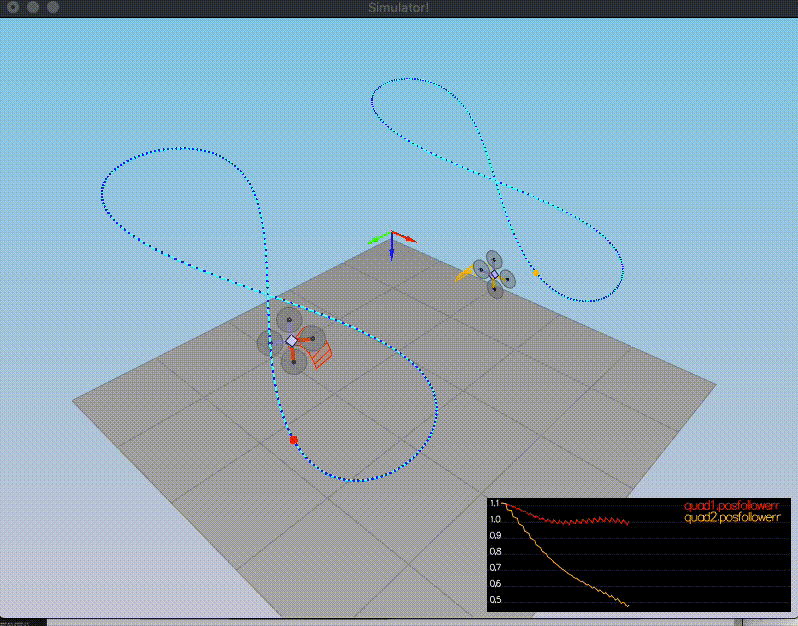

# Project: Quadrotor 3D Controller #

## Project Description ##
Implementing a cascade controller for quadrotors in C++ to control body rate/pitch/yaw, altitude, and lateral position.


## Scenario 2: Body rate and roll/pitch control ##

`[RUBRIC]`  The controller should be a proportional controller on body rates to commanded moments. The controller should take into account the moments of inertia of the drone when calculating the commanded moments.

1. Implement body rate control 

Body Rate Controller is a P Controller.The commanded roll, pitch, and yaw are collected by the body rate controller, and they are translated into the desired moment along the axis in the body frame. 

  * `GenerateMotorCommands()` 

The total thrust and the moments created by the propellers;

  <!-- $F_{total}$ = $F_1$ + $F_{2}$ + $F_3$ + $F_4$
  $\tau_x$ = ($F_1$ - $F_2$ + $F_3$ - $F_4$) * $l$
  $\tau_y$ = ($F_1$ + $F_2$ - $F_3$ - $F_4$) * $l$
  $\tau_z$ = - ( $F_1$ - $F_2$ - $F_3$ + $F_4$ ) * $\kappa$  -->

 


  Where F_1 to F_4 represents the target thrust of each motor, tau(x, y, z) are the moments in each direction, F_total is the total thrust, kappa is the drag/thrust ratio, and l is the drone arm length over the square root of two.

```cpp
    float l = L / sqrtf(2.f);
    float uBar = collThrustCmd; // F1 + F2 + F3 + F4
    float pBar = momentCmd.x / l; // F1 + F3 - F2 - F4
    float qBar = momentCmd.y / l; // F1 + F2 - F3 - F4
    float rBar = -momentCmd.z / kappa; // F1 - F2 + F4 - F3
    
    float f1 = (uBar + pBar + qBar + rBar) / 4.f; // front left
    float f2 = (uBar - pBar + qBar - rBar) / 4.f; // front right
    float f3 = (uBar + pBar - qBar - rBar) / 4.f; // rear left
    float f4 = (uBar - pBar - qBar + rBar) / 4.f; // rear right
    
    cmd.desiredThrustsN[0] = f1; // front left
    cmd.desiredThrustsN[1] = f2; // front right
    cmd.desiredThrustsN[2] = f3; // rear left
    cmd.desiredThrustsN[3] = f4; // rear right
```
 - `BodyRateControl()`

```cpp
    V3F err = pqrCmd - pqr;
    V3F ubar = err * kpPQR;
    momentCmd = ubar * V3F(Ixx,Iyy, Izz);
```

All Done!

  ---

`[RUBRIC]` The controller should use the acceleration and thrust commands, in addition to the vehicle attitude to output a body rate command. The controller should account for the non-linear transformation from local accelerations to body rates. Note that the drone's mass should be accounted for when calculating the target angles.


2. Implement roll / pitch control

The roll-pitch controller is a P controller. Responsible for commanding the roll and pitch rates ( p_c and  q_c ) in the body frame.

 - `RollPitchControl()`

 The following equations were used to implement to roll-pitch controller:
 
 


Elementes R13 and R23 of the rotation matrix from body-frame accelerations and world frame accelerations are implemented as a P controller.

The following equation was also applied to allow the output to be in terms of roll and pitch rates:

 

```cpp
    if ( collThrustCmd > 0 ) {
        float c = -collThrustCmd / mass;
        float b_x_c_target = CONSTRAIN(accelCmd.x / c , -maxTiltAngle, maxTiltAngle);
        float b_x_err = b_x_c_target - R(0,2);
        float b_dot_x_c_target = kpBank * b_x_err;
        //
        float b_y_c_target = CONSTRAIN(accelCmd.y / c, -maxTiltAngle, maxTiltAngle);
        float b_y_err = b_y_c_target - R(1,2);
        float b_dot_y_c_target = kpBank * b_y_err;
        //
        pqrCmd.x = (R(1,0) * b_dot_x_c_target - R(0,0) * b_dot_y_c_target / R(2,2));
        pqrCmd.y = (R(1,1) * b_dot_x_c_target - R(0,1) * b_dot_y_c_target / R(2,2));
    }
    else
    {
        pqrCmd.x = 0.0;
        pqrCmd.y = 0.0;
```

  

All Done!

----

### Position/velocity and yaw angle control (scenario 3) ###

**`[RUBRIC]`** The controller should use both the down position and the down velocity to command thrust. Ensure that the output value is indeed thrust (the drone's mass needs to be accounted for) and that the thrust includes the non-linear effects from non-zero roll/pitch angles.
* `LateralPositionControl()`

Lateral Controller is a PD controller to control acceleration on x and y.
 

```cpp

    V3F kpPos;
    kpPos.x = kpPosXY;
    kpPos.y = kpPosXY;
    kpPos.z = 0.f;
    
    V3F kpVel;
    kpVel.x = kpVelXY;
    kpVel.y = kpVelXY;
    kpVel.z = 0.f;
    
    V3F capVelCmd;
    if ( velCmd.mag() > maxSpeedXY ) {
        capVelCmd = velCmd.norm() * maxSpeedXY;
    } else {
        capVelCmd = velCmd;
    }
    
    accelCmd = kpPos * ( posCmd - pos ) + kpVel * ( capVelCmd - vel ) + accelCmd;
    
    if ( accelCmd.mag() > maxAccelXY ) {
        accelCmd = accelCmd.norm() * maxAccelXY;
    }
```

**`[RUBRIC]`** the C++ altitude controller should contain an integrator to handle the weight non-idealities presented in scenario 4.
* `AltitudeControl()`
 Altitude Controller is a PD controller to control the acceleration, or thrust, needed to adjust the quad's altitude

The following equations were used to implement:
<!-- $$
\begin{pmatrix} \ddot{x} \\ \ddot{y} \\ \ddot{z}\end{pmatrix}  = \begin{pmatrix} 0 \\ 0 \\ g\end{pmatrix} + R \begin{pmatrix} 0 \\ 0 \\ c \end{pmatrix} 
$$ where $R = R(\psi) \times R(\theta) \times R(\phi)$. 
$$
\ddot{x} = c b^x \\ 
\ddot{y} = c b^y \\ 
\ddot{z} = c b^z +g
$$ where $b^x = R_{13}$, $b^y= R_{23}$ and $b^z = R_{33}$ 

$$\bar{u}_1 = \ddot{z} = c b^z +g$$ 

$$c = (\bar{u}_1-g)/b^z$$  

$$\bar{u}_1 = k_{p-z}(z_{t} - z_{a}) + k_{d-z}(\dot{z}_{t} - \dot{z}_{a}) + \ddot{z}_t$$ -->
  

```cpp
    float posZ_error = posZCmd - posZ;
    float proportional = kpPosZ * posZ_error;

    float derivative = kpVelZ * (velZCmd - velZ)  ;

    float b_z = R(2,2);

    float u_1_bar = proportional + derivative  + accelZCmd ;

    float acc = ( u_1_bar - CONST_GRAVITY ) / b_z;

    thrust = - mass * CONSTRAIN(acc, - maxAscentRate / dt, maxAscentRate / dt);

  ```

[RUBRIC] The controller can be a linear/proportional heading controller to yaw rate commands (non-linear transformation not required).
Implement calculating the motor commands given commanded thrust and moments in C++.

* `YawControl()`
It is a P controller. It is better to optimize the yaw to be between [-pi, pi]. Formula required:

  <!-- $r_c = k_p (\psi_t - \psi_a)$ -->

  

```cpp

    float yawCmd_modded = fmodf(yawCmd, 2 * F_PI);
    if ( yawCmd > 0 ) {
        yawCmd_modded = fmodf(yawCmd, 2 * F_PI);
    } else {
        yawCmd_modded = -fmodf(-yawCmd, 2 * F_PI);
    }
    float yaw_err = yawCmd_modded - yaw;
    if ( yaw_err > F_PI ) {
        yaw_err -= 2 * F_PI;
    } if ( yaw_err < -F_PI ) {
        yaw_err += 2 * F_PI;
    }
    yawRateCmd = kpYaw * yaw_err;
```
  


### Non-idealities and robustness (scenario 4) ###

Integral component added with 3 lines,

```cpp
    integratedAltitudeError += posZ_error * dt;
    float integrated = KiPosZ * integratedAltitudeError;
```
```cpp
    float u_1_bar = proportional + derivative  + accelZCmd + integrated;
```


  

### Tracking trajectories ###
My original QuadParams did not make the drone fly succesfuly. Therefore, I've updated some of them then check for other scenerios are ok.

  

References:
* Udacity Flying Car Nanodegree Program.
[//]: # (Bürke Atilla // June 2019 )